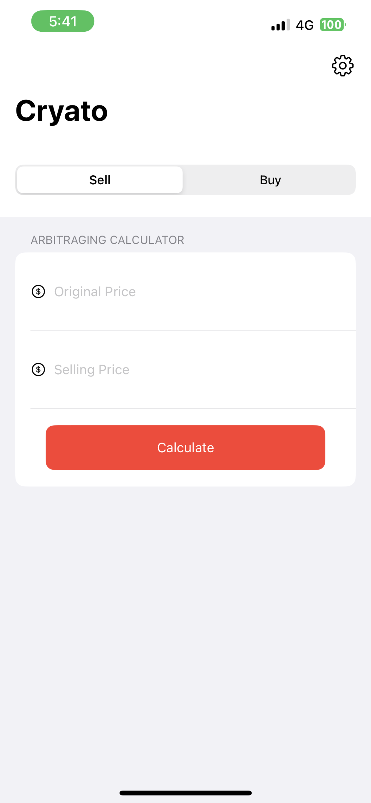
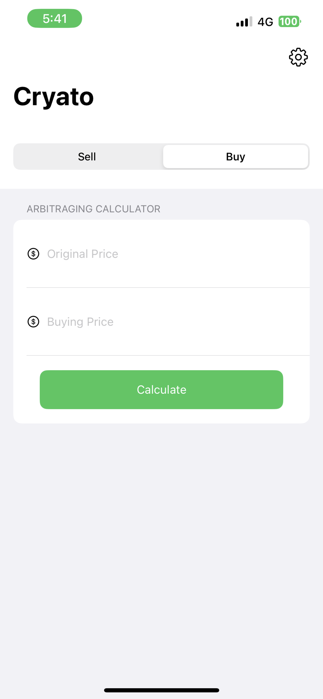
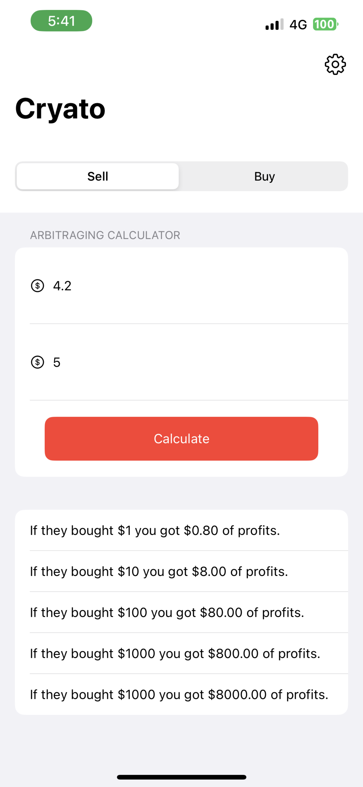
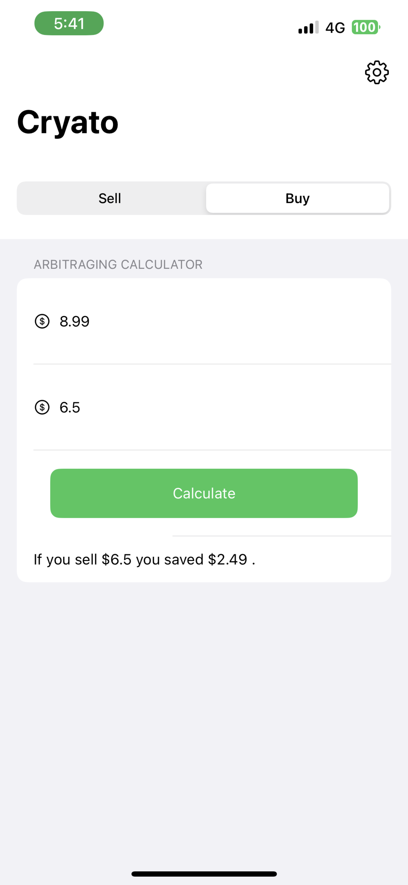
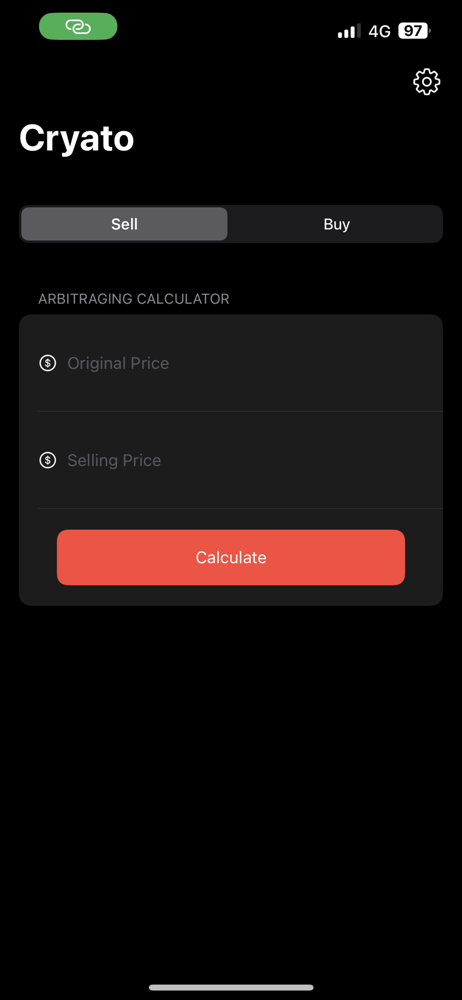
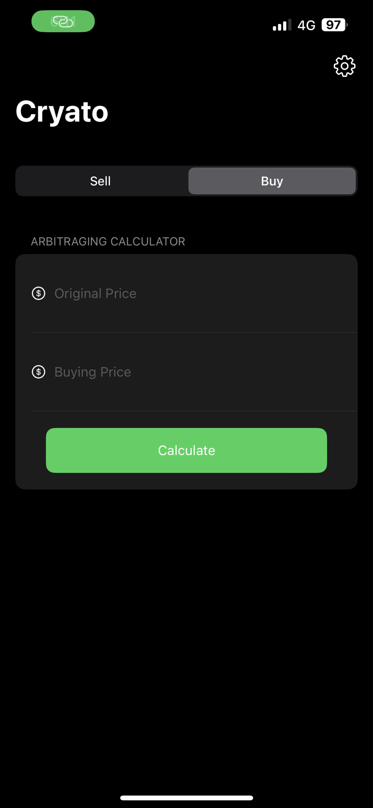
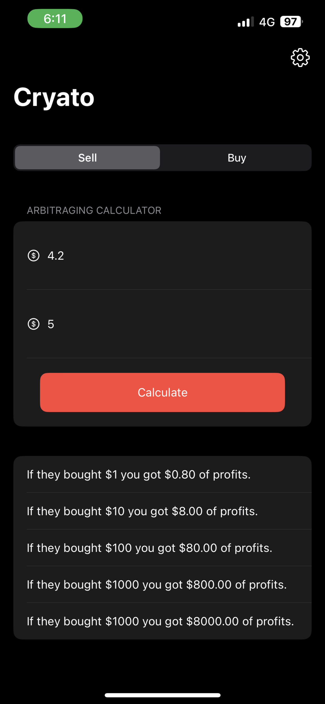
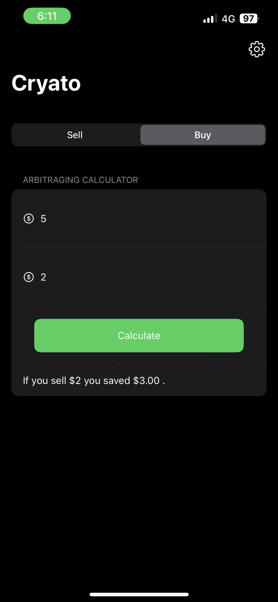
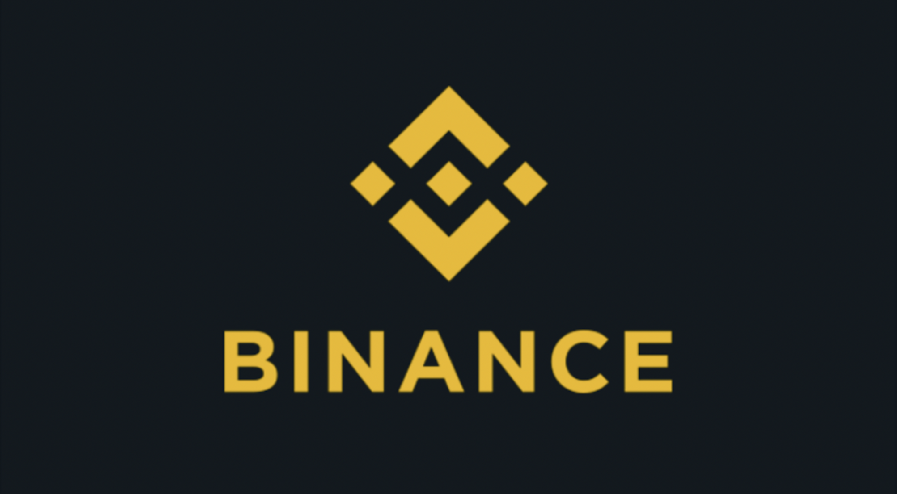

# Cryato

### Introduction

Cryato is a mobile app that makes crypto arbitrage calculations easy.
It is an offline app that allows users to calculate their profits from buying and selling
different cryptocurrencies on different exchanges, taking into account the latest
exchange rates and market conditions. The app is designed to be simple and easy to
use, and does not require any prior knowledge of trading or crypto arbitrage. With
Cryato, users can make informed investment decisions and maximize their profits
from arbitraging in cryptocurrency.

《Cryato》 是一款移动应用程序，可使加密货币套利计算变得简单。这是一款离线应用程序，
允许用户在考虑最新的汇率和市场条件的情况下，计算从不同交易所购买和出售不同加密货币所获利润。
该应用程序旨在简单易用，不需要任何交易或加密货币套利方面的先前知识。通过《Cryato》，用户可以
做出明智的投资决策，最大化从加密货币套利中获得的利润。

Cryato - это мобильное приложение, которое упрощает расчеты по криптоарбитражу. 
Оно является оффлайн-приложением, которое позволяет пользователям рассчитывать свою 
прибыль от покупки и продажи различных криптовалют на разных биржах, учитывая последние 
обменные курсы и рыночные условия. Приложение разработано таким образом, чтобы быть 
простым и удобным в использовании и не требовать никаких предварительных знаний в области 
торговли или криптоарбитража. С Cryato пользователи могут принимать обоснованные 
инвестиционные решения и максимизировать свою прибыль от арбитража криптовалют.

### License

```
MIT License

Copyright (c) 2023 John Melody Me

Permission is hereby granted, free of charge, to any person obtaining a copy
of this software and associated documentation files (the "Software"), to deal
in the Software without restriction, including without limitation the rights
to use, copy, modify, merge, publish, distribute, sublicense, and/or sell
copies of the Software, and to permit persons to whom the Software is
furnished to do so, subject to the following conditions:

The above copyright notice and this permission notice shall be included in all
copies or substantial portions of the Software.

THE SOFTWARE IS PROVIDED "AS IS", WITHOUT WARRANTY OF ANY KIND, EXPRESS OR
IMPLIED, INCLUDING BUT NOT LIMITED TO THE WARRANTIES OF MERCHANTABILITY,
FITNESS FOR A PARTICULAR PURPOSE AND NONINFRINGEMENT. IN NO EVENT SHALL THE
AUTHORS OR COPYRIGHT HOLDERS BE LIABLE FOR ANY CLAIM, DAMAGES OR OTHER
LIABILITY, WHETHER IN AN ACTION OF CONTRACT, TORT OR OTHERWISE, ARISING FROM,
OUT OF OR IN CONNECTION WITH THE SOFTWARE OR THE USE OR OTHER DEALINGS IN THE
SOFTWARE.

版权所有（c）2023 John Melody Me

特此授予任何获得本软件和相关文档文件（“软件”）副本的人免费许可证，以在软件中不受限制地处理软件，
包括但不限于使用、复制、修改、合并、出版、分发、再许可和/或销售软件的副本，并允许提供软件的人员这样做，
前提是：

上述版权声明和本许可声明应包含在所有副本或实质性部分中。

该软件按“原样”提供，不提供任何形式的明示或暗示担保，包括但不限于适销性、特定用途的适用性和非侵权性。
在任何情况下，作者或版权所有者均不对任何索赔、损害赔偿或其他责任承担责任，无论是在合同、侵权行为或其他方面，
由本软件引起或与之相关的，或者使用或其他交易中的软件。

Лицензия MIT (MIT License)

Данное разрешение предоставляется любому лицу, получившему копию данного программного 
обеспечения и связанных с ним документов (в дальнейшем именуемыми "Программное Обеспечение"), 
без ограничений на использование, копирование, изменение, слияние, публикацию, распространение, 
сублицензирование и/или продажу копий Программного Обеспечения, а также лицам, которым 
предоставляется данное Программное Обеспечение, при соблюдении следующих условий:

Условия и ограничения на использование, копирование, изменение, слияние, публикацию, 
распространение
```

### Beta Version (Tesflight)

[Click Here](https://testflight.apple.com/join/MxNNeoaA)

### Download

<div id="download">
   <a href="https://apps.apple.com/us/app/cryato/id1669208377">
    
   </a>
</div>

### Screenshots

<div id="group-1">
    
    
    
    
    
    
    
    
</div>

</br>

### Support This Project

> Click on the icon to proceed to donate :)

<div id="support">
    <a href="https://wise.com/pay#l8QXeH1uJDssR1cpz9lKNqdXA9s">
        
    </a>
    <a href="https://s.binance.com/gD13X5H1">
        
    </a>
</div>

or

<div id="group-2">
    
</div>
